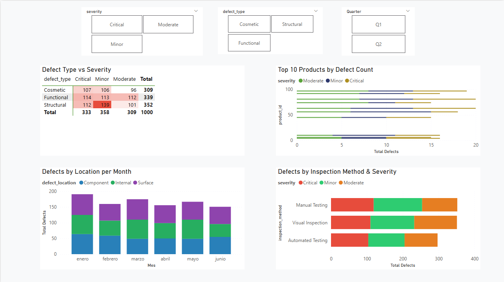
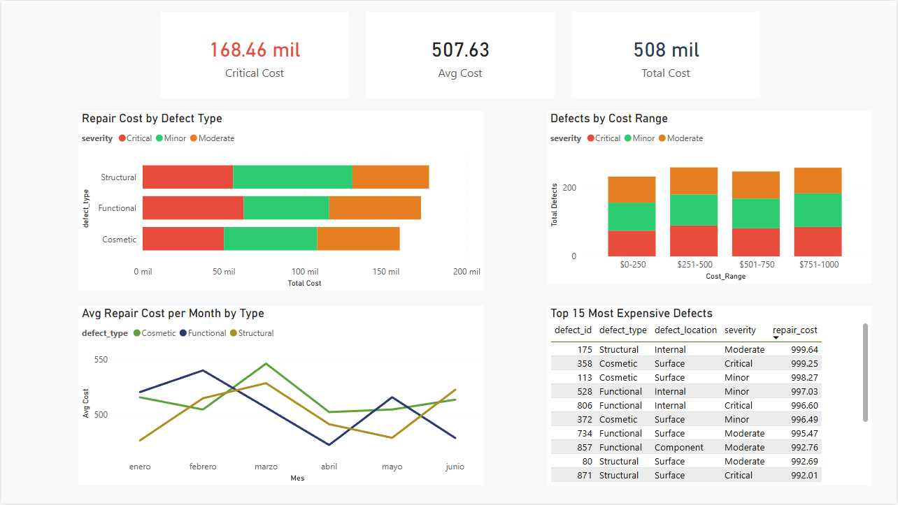

# 🔬 Manufacturing Defects Dashboard
### Quality Control Intelligence — From raw defect data to actionable insights in Power BI


---

## 🎯 The Problem

In manufacturing operations, quality control generates large volumes of defect data that is rarely analyzed beyond basic counts. The typical process — a spreadsheet with defect logs reviewed weekly — answers only one question: *how many defects did we have?*

It does not answer the questions that actually drive decisions:
- Which defect types generate the most repair cost?
- Is the critical defect rate improving or worsening over time?
- Which products consistently concentrate the most defects?
- Does the inspection method affect the severity of defects detected?

This project transforms a raw defect dataset into a **3-page interactive Power BI dashboard** that answers all of these questions and enables drill-down filtering by severity, type, and time period.

---

## 📊 Key Findings

- **1,000 defects** analyzed across a 6-month period (January–June 2024)
- **33.3% critical defect rate** — 1 in 3 defects requires urgent intervention, significantly above industry benchmarks
- **$507,630 total repair cost** with an average of **$507.63 per defect**
- **$168,460 (33.2%)** of total repair cost is driven exclusively by critical defects
- **Structural defects** generate the highest total repair cost despite not being the most frequent type
- **No inspection method** shows a significantly lower critical defect rate — suggesting the issue is in the process, not the detection method
- Repair costs are **uniformly distributed** across all cost ranges ($0-$1,000), indicating no single cost driver dominates

---

## 🗂️ Project Structure

```
manufacturing-defects-dashboard/
│
├── Data/
│   ├── manufacturing_defects.csv         ← Original Kaggle dataset
│   └── manufacturing_defects_clean.csv   ← Cleaned dataset (Python output)
│
├── Scripts/
│   └── data_preparation.py               ← Python cleaning & feature engineering
│
├── Dashboard/
│   └── Manufacturing_Defects.pbix        ← Power BI dashboard file
│
├── Screenshots/
│   ├── Executive_Overview.png
│   ├── Defect_Analysis.png
│   └── Cost_Impact.png
│
└── README.md
```

---

## 📸 Dashboard Preview

### Page 1 — Executive Overview
*For: Management / Quality Director*


Key visuals: 4 KPI cards · Monthly defect trend by severity · Repair cost by type & severity · Defects by severity and type distribution

---

### Page 2 — Defect Analysis
*For: Quality Engineers / QA Team*



Key visuals: Interactive slicers (Severity / Type / Quarter) · Defect Type vs Severity heatmap matrix · Top 10 products by defect count · Defects by location per month · Inspection method effectiveness

---

### Page 3 — Cost Impact
*For: Finance / Operations*



Key visuals: Critical cost KPI · Repair cost by defect type · Defects by cost range · Average cost trend per month · Top 15 most expensive defects table

---

## 🔬 Methodology

### Data Preparation (Python)

The raw dataset required the following transformations before loading into Power BI:

```python
# Date parsing and time dimension extraction
df['defect_date'] = pd.to_datetime(df['defect_date'])
df['Month']       = df['defect_date'].dt.month
df['Quarter']     = df['defect_date'].dt.quarter.apply(lambda x: f'Q{x}')
df['Week']        = df['defect_date'].dt.isocalendar().week.astype(int)

# Severity encoding for sorting
severity_order = {'Minor': 1, 'Moderate': 2, 'Critical': 3}
df['Severity_Rank'] = df['severity'].map(severity_order)

# Cost range classification
df['Cost_Range'] = pd.cut(df['repair_cost'],
    bins=[0, 250, 500, 750, 1000],
    labels=['$0-250', '$251-500', '$501-750', '$751-1000'])

# Critical flag
df['Is_Critical'] = (df['severity'] == 'Critical').astype(int)
```

### Power BI Data Model

The model uses a **star schema** with a dedicated Date table connected to the fact table:

```
Fechas (Date Table)
    Date (PK)
    Month Number
    Month Name
    Quarter
    Year
        │
        │ 1:*
        ▼
manufacturing_defects_clean (Fact Table)
    defect_id · product_id · defect_type
    defect_date · defect_location · severity
    inspection_method · repair_cost
    [+ calculated columns from Python]
```

### DAX Measures

```dax
Total Defects = COUNTROWS('manufacturing_defects_clean')

Total Cost = SUM('manufacturing_defects_clean'[repair_cost])

Critical Rate =
DIVIDE(
    COUNTROWS(FILTER('manufacturing_defects_clean',
        'manufacturing_defects_clean'[severity] = "Critical")),
    COUNTROWS('manufacturing_defects_clean')
)

Critical Cost =
CALCULATE(
    SUM('manufacturing_defects_clean'[repair_cost]),
    'manufacturing_defects_clean'[severity] = "Critical"
)

MoM Change =
VAR CurrentMonth = CALCULATE(COUNTROWS('manufacturing_defects_clean'))
VAR PrevMonth = CALCULATE(
    COUNTROWS('manufacturing_defects_clean'),
    DATEADD('manufacturing_defects_clean'[defect_date], -1, MONTH))
RETURN DIVIDE(CurrentMonth - PrevMonth, PrevMonth)
```

---

## 💡 Business Recommendations

1. **33.3% critical rate requires immediate root cause analysis**
   A critical defect rate of 1 in 3 is unsustainable from both a quality and cost perspective. The first priority is identifying whether this rate is driven by a specific production line, shift, or supplier — none of which are visible in this dataset but would be the logical next investigation.

2. **Structural defects drive the highest repair cost — not the most frequent type**
   Despite Structural defects representing only 35.2% of total defects, they generate a disproportionate share of repair cost. Process improvement efforts should prioritize Structural defect prevention over volume reduction.

3. **Inspection method does not differentiate critical detection rate**
   All three inspection methods (Visual, Manual, Automated Testing) show similar critical defect proportions. This suggests the problem is upstream — in the production process — rather than in the inspection stage. Investing in more inspection methods alone will not reduce the critical rate.

4. **Enrich the dataset with production line and operator data**
   The current dataset lacks two critical dimensions: which production line generated the defect, and which operator or shift was active. Adding these fields would transform this descriptive dashboard into a root cause analysis tool.

---

## ⚙️ Setup & Usage

### Requirements
```bash
pip install pandas numpy openpyxl
```

### Data preparation
```bash
python Scripts/data_preparation.py
```

### Open the dashboard
Open `Dashboard/Manufacturing_Defects.pbix` in **Power BI Desktop**.

If the data source path needs updating:
1. **Home → Transform data → Data source settings**
2. Update the path to `manufacturing_defects_clean.csv`
3. **Refresh**

---

## 🔭 Next Steps

| Enhancement | Data Required | Value Added |
|---|---|---|
| Add production line dimension | ERP/MES extract | Identify which lines drive critical defects |
| Add operator/shift data | HR or MES system | Root cause analysis by team |
| Connect to live SAP data | SAP MM/QM modules | Real-time quality monitoring |
| Add defect cost targets | Finance input | KPI tracking vs budget |
| Predictive defect model | 12+ months history | Forecast defect rate by product |

---

## 🏭 Background

This project was built as part of a professional transition from SAP Functional Analysis to Data Analytics, combining manufacturing domain expertise with Power BI development skills.

The dataset is synthetic and sourced from Kaggle. The business context, recommendations, and analytical approach reflect real quality control processes observed in manufacturing operations.

---

## 🛠️ Tech Stack

`Python 3.10` · `Pandas` · `Power BI Desktop` · `DAX`

---

## 📄 License

MIT License — free to use, adapt and build upon.
